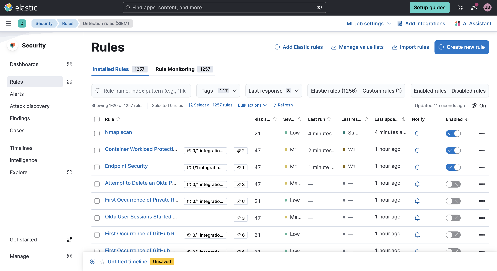
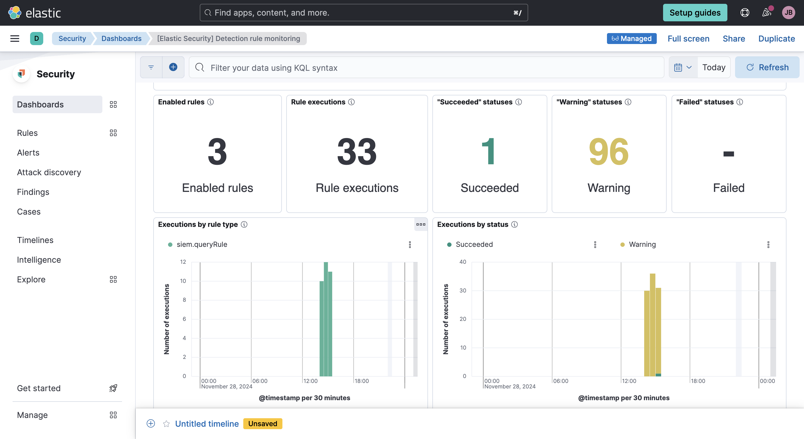
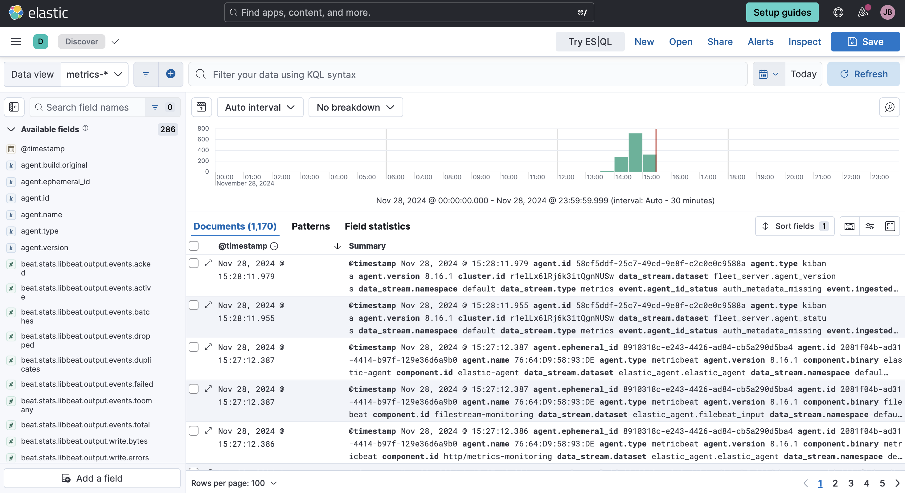
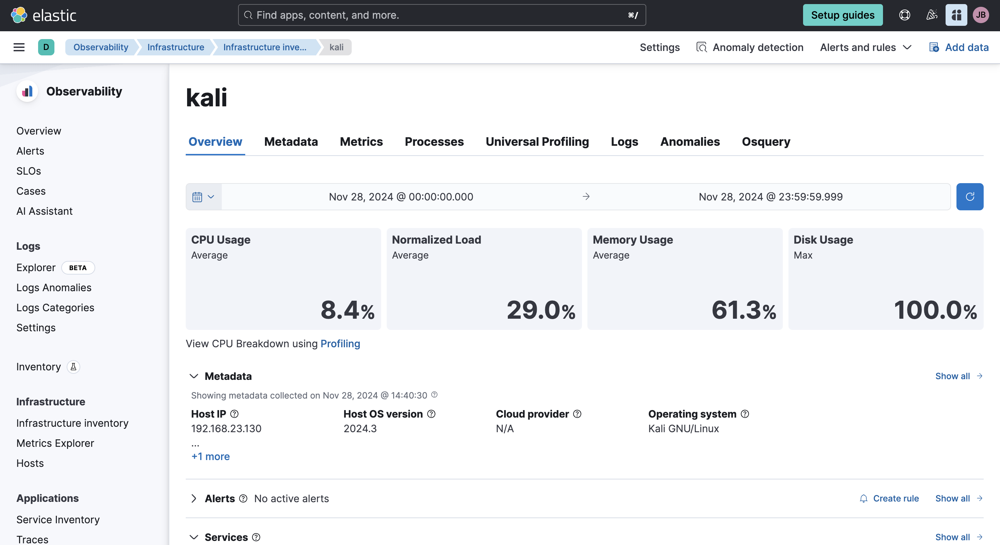
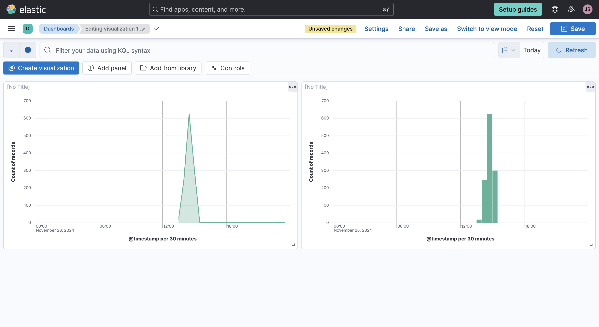
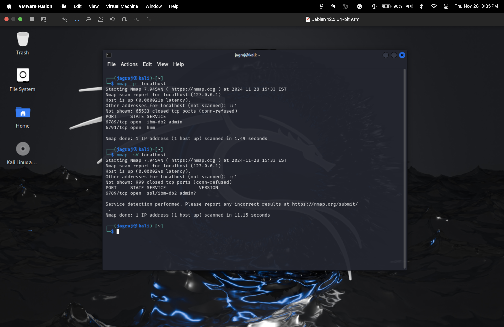

# Elastic SIEM Home Lab Project

## Objective
The objective of this project was to build a home lab environment to simulate and analyze security events using the Elastic Security Information and Event Management (SIEM) system. The project involved ingesting logs, generating test telemetry, and performing detailed log analysis to identify and respond to potential security threats. This hands-on approach was designed to enhance practical cybersecurity skills.

## Skills Learned
- Configuring and managing Elastic SIEM for real-time log analysis.
- Deploying and managing virtual machines using VMware.
- Analyzing and interpreting security events, such as Nmap scans.
- Creating visual dashboards to track and identify anomalies in event data.
- Designing and implementing custom alert rules for proactive threat detection.

## Tools Used
- **Elastic SIEM**: For log ingestion, querying, and visualization.
- **Kali Linux**: Used as a test environment for generating security telemetry.
- **Nmap**: To simulate reconnaissance and generate logs for analysis.
- **VMware Fusion**: For virtualization and running the Kali Linux VM.

---

## Steps

### Step 1: Setting Up Elastic SIEM
I created a free Elastic Cloud account and deployed the SIEM environment.

**Rules Overview**

The screenshot shows the detection rules within Elastic SIEM. Rules like "Nmap Scan" were enabled for monitoring specific security events.

---

### Step 2: Configuring the Elastic Agent
I installed the Elastic Agent on my Kali Linux VM to forward logs to the SIEM.

**Dashboard Overview**

The dashboard displays a summary of enabled rules, rule executions, and their statuses, providing insights into the monitoring environment.

---

### Step 3: Generating Security Telemetry
Using Nmap, I conducted various network scans to generate logs. This included scanning localhost for open ports and service versions.

**Nmap Scan Results**

Nmap results showing open ports and detected services on localhost. These scans generated logs for analysis in the SIEM.

---

### Step 4: Analyzing Logs in Elastic SIEM
I used the Elastic Discover tool to query and analyze the logs ingested from the Kali VM.

**Log Analysis**

This screenshot highlights the detailed log entries, including timestamps, event IDs, and other metadata for security events.

---

### Step 5: Creating Dashboards
I built a custom dashboard to visualize security events over time.

**Visualization of Events**

Custom visualizations display event trends, such as spikes in detected scans, helping identify unusual patterns.

---

### Step 6: Monitoring System Performance
Using Elastic's observability tools, I monitored the Kali Linux VM's performance metrics.

**System Metrics**

The screenshot shows resource usage for the Kali VM, including CPU, memory, and disk utilization.

---

## Conclusion
This project provided hands-on experience in configuring and using Elastic SIEM for monitoring and detecting security events. The integration of tools like Nmap and Elastic Agent allowed me to simulate real-world attacks and analyze the data to create actionable insights. This lab environment serves as a strong foundation for understanding SIEM operations and incident response workflows.
